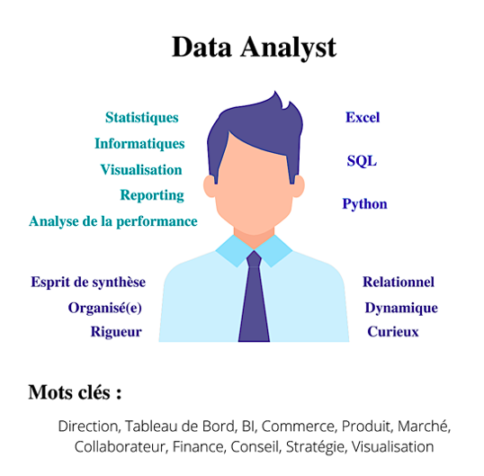
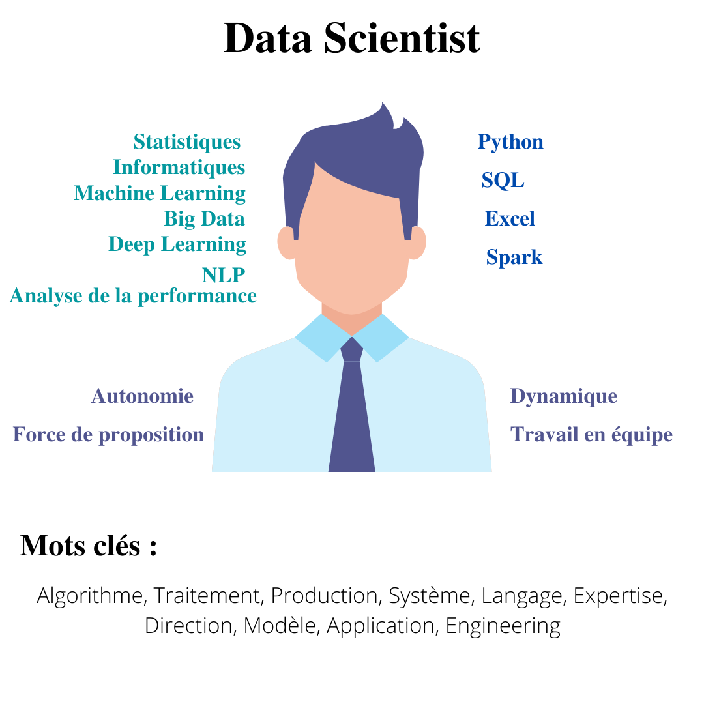
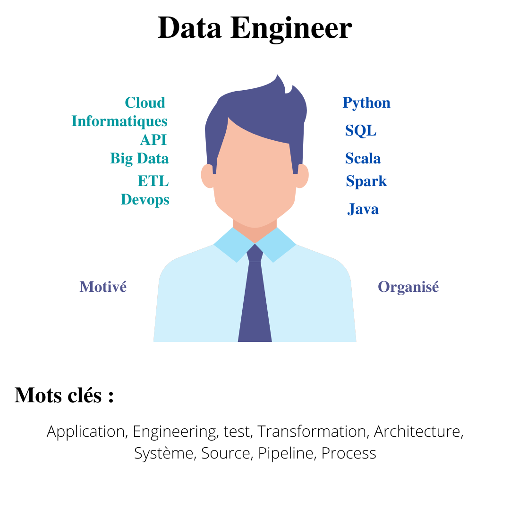

```{r setup, include=FALSE}
knitr::opts_chunk$set(echo = FALSE)
```

Grâce aux résultats de nos analyses nous avons réalisé des fiches métier. Ces fiches métiers comprennent les **compétences techniques, informatiques et les qualités humaines** nécessaires pour chacun des trois postes. 
De plus, on retrouve les 10 mots les plus utilisés dans les annonces de chaque poste. Ainsi, ces **mots clés** peuvent être utilisés dans le CV afin que ce dernier soit retenu par l'algorithme de NLP utilisé par les **ressources humaines** lors du recrutement. 

&nbsp;

<p style="width:70%">

</p>

&nbsp;

<p style="width:70%">

</p>

&nbsp;

<p style="width:80%">

</p>


&nbsp;


&nbsp;

<p align="center">
<a href="http://mecen-univ-tours.fr/">

</a>
</p>